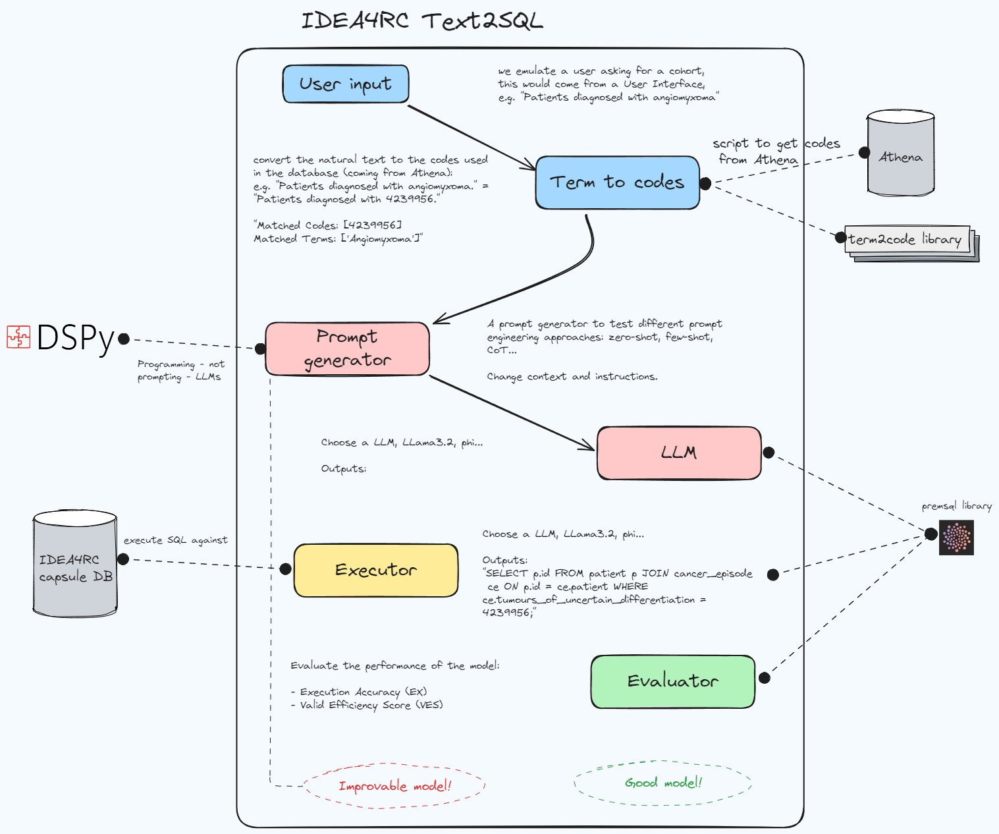
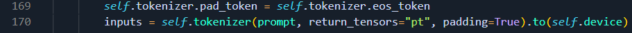

# IDEA4RC-TEXT2SQL

This repository presents a framework for evaluating user like inputs asking to build cohorts to a SQL generator LLM. It is based and inspired by the PremAISQL library.

Things not implemented yet:

- Evaluation only works for accuracy, we should include VES.
- Not fine-tuning or training setup.
- DSPY compatibility is WIP.
- QLORA, LORA etc. to better handle the LLMs.

Improvements and pitfalls:

- [] We currently don't have any IDEA4RC dataset to finetune the model.
- [] Should we try to select the DDL statements to provide as a context to the LLM?
    - [] Could we run a string matching algorithm to know what tables are involved?
    - [] Could we embed the data from the DM tables into an embedding (one per table) and follow a RAG-like approach?
- [] Some terminology used by the clinicians is not one-to-one in the IDEA4RC DB, e.g. we don't have a "diagnosis" table.
- [x] ~~Most likely we need to relate the variable value that is usually provided in the inpiut query to the variable name. Adenocarcinoma  -> Diagnosis histology.~~

## Overall architecture



## How to

The framework is relatively easy to use.

1. The pipeline is presented in the overall architecture figure. Each specific module has a script in its corresponding directory.
2. If you wan to customize a particular part of the pipeline you must edit the corresponding script. For instance, if I would like to change the prompt generation I would edit the `src/prompt_generators/text2SQL_CustomPromptGenerator.py` file. The terms to code module is at the moment included within the main agent file.
3. The pipeline and modules run throught the main agent file `src/agents/text2sql_agent.py`. It's just a wrapper for the modules.
4. To obtain the evaluation we need to execute the queries against a SQL DB. For IDEA4RC you can deploy a demo DB (currently only has data for Patient and CancerEpisode tables) through the docker compose script in the docker directory.

```
cd docker
docker compose up --force-recreate -d
```

5. Once the DB is running the pipeline evaluates the accuracy of the created SQL statement by comparing the results obtained with the label SQL.

The data used for the demonstration comes for the IDEA4RC example use cases and can be found in the `inputs/queries.json` file. Consists of a user query to obtain a cohort and their corresponding label SQL statements.

## Requirements

- `pip install premsql tabulate accelerate mysql-connector-python dspy-ai`
- Docker for deploying the demo IDEA4RC DB.

## Metrics (WIP)

Accuracy
VES

## Deployment

```
cd docker
docker compose up --force-recreate -d
cd ../src
python demo.py
```

This should run the demonstration that follows the pipeline and gives the result for the data within the input directory. The model can be changed in the `demo.py` file.

**NOTE**

To work with DSPY you need to do the following modification in the original dspy library.



the file is:

`python3.10/site-packages/dsp/modules/hf.py`